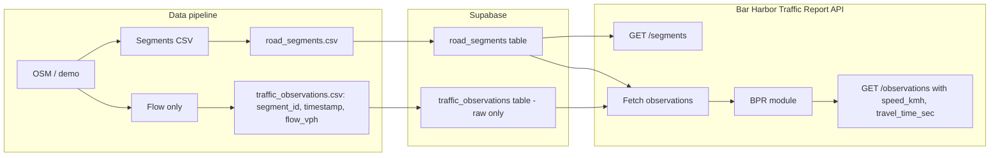

# BPR-to-API Architecture and Bar Harbor Traffic Report

## Current state

- **Pipeline** (`[data_pipeline/generate_traffic_data BARHARBOR.py](data_pipeline/generate_traffic_data%20BARHARBOR.py)`): Steps 1–5 produce segments and flow-only observations; **Step 6** (`apply_bpr`, lines 403–411) computes `speed_kmh` and `travel_time_sec` via BPR; Step 7 exports CSVs. BPR uses `BPR_ALPHA`/`BPR_BETA` from `[data_pipeline/config.py](data_pipeline/config.py)`.
- **Output** `[data_pipeline/output/traffic_observations.csv](data_pipeline/output/traffic_observations.csv)`: `segment_id`, `timestamp`, `flow_vph`, `speed_kmh`, `travel_time_sec`.
- **API** (`[supabase and api/api_main.py](supabase%20and%20api/api_main.py)`, `[api/routers/traffic.py](supabase%20and%20api/api/routers/traffic.py)`): Placeholder routes; no Supabase client or BPR logic.
- **Supabase** (`[supabase and api/public_api_key.txt](supabase%20and%20api/public_api_key.txt)`, `[SQL_query](supabase%20and%20api/SQL_query)`): Tables `road_segments` and `traffic_observations`; observations currently include `speed_kmh` and `travel_time_sec`.

---

## 1. Pipeline: Remove BPR and export raw sensor CSV

**1.1 Extract and store BPR logic for reuse**

- Add a small, dependency-light module that the API can import (no OSM/geopandas). Options:
  - **Preferred**: New file in the API tree, e.g. `supabase and api/bpr.py`, containing the BPR formula and constants so the API is self-contained.
  - Alternatively: a shared package under repo root (e.g. `shared/bpr.py`) if you want both pipeline tests and API to share it.
- Implement a single function with the same contract as current `apply_bpr`: inputs `(observations: DataFrame with segment_id, flow_vph; segments: DataFrame with segment_id, length_m, free_flow_speed_kmh, capacity_vph)`, plus `alpha`, `beta`; output DataFrame with added `speed_kmh` and `travel_time_sec`. Logic:  
`t0_sec = length_m/1000 / (free_flow_speed_kmh/3600)`, `ratio = min(flow_vph/capacity_vph, 3.0)`, `t_sec = t0 * (1 + alpha * ratio^beta)`, `speed_kmh = (length_m/1000) / (t_sec/3600)`.

**1.2 Remove BPR from the generate script**

- In `[data_pipeline/generate_traffic_data BARHARBOR.py](data_pipeline/generate_traffic_data%20BARHARBOR.py)`:
  - Remove the call to `apply_bpr` and the export of observations that include `speed_kmh` and `travel_time_sec`.
  - After Step 5, observations should only have `segment_id`, `timestamp`, `flow_vph`.
  - Keep validation that operates on segment IDs and timestamps; adjust if it currently expects speed/travel_time columns.

**1.3 Export traffic_observations as “raw sensor” CSV**

- Write `traffic_observations.csv` with columns: `**segment_id`, `timestamp`, `flow_vph`** only (no `speed_kmh`, no `travel_time_sec`).  
- **Clarification**: The plan assumes “without the time column” means “without the BPR-derived columns” (speed and travel time), so we keep `timestamp` for temporal queries. If you instead want to drop the `timestamp` column, the export would be `segment_id`, `flow_vph` only; the API would then have no time dimension unless you add it back elsewhere.

**1.4 Supabase schema alignment**

- Update `[supabase and api/SQL_query](supabase%20and%20api/SQL_query)` (and any live Supabase table) so `traffic_observations` stores only raw sensor data: `id`, `segment_id`, `timestamp`, `flow_vph`. Remove `speed_kmh` and `travel_time_sec` from the table (or leave columns out of the insert and document that the API computes them). Re-upload or re-import CSVs after schema change.

---

## 2. FastAPI “Bar Harbor Traffic Report”: Supabase + BPR and two endpoints

**2.1 Dependencies and app title**

- Add to API requirements (or project `[requirements.txt](requirements.txt)` if the API is run from repo root): `httpx` (or `requests`) and `supabase` (or direct REST with `httpx`) for Supabase; `pandas` for in-memory BPR. Ensure FastAPI and uvicorn are present.
- Set app title to **“Bar Harbor Traffic Report”** in `[supabase and api/api_main.py](supabase%20and%20api/api_main.py)`.

**2.2 Supabase client and config**

- Add configuration for Supabase URL and anon key (env vars, e.g. `SUPABASE_URL`, `SUPABASE_ANON_KEY`), read at startup.
- Create a small client module or inline code that fetches:
  - **Road segments**: all rows from `road_segments`.
  - **Traffic observations**: all rows from `traffic_observations` (columns: `segment_id`, `timestamp`, `flow_vph` only from DB).

**2.3 BPR in the API**

- Use the BPR module from step 1. On each request that needs derived metrics (or once at startup if data is small and cached), build a segments DataFrame and an observations DataFrame from Supabase, then run the BPR function to add `speed_kmh` and `travel_time_sec` to the observations.

**2.4 Two endpoints (top-level, no `/traffic/` prefix)**

- Mount the router with no prefix so segments and observations are clearly separate at the root: `GET /segments` and `GET /observations`.
- **Passthrough to Supabase road segments**
  - `GET /segments`: return JSON list of rows from `road_segments` as returned by Supabase (no BPR). Response model can use existing/updated `[api/schemas.py](supabase%20and%20api/api/schemas.py)` (e.g. `RoadSegment` with segment_id, geometry_wkt, length_m, road_class, lanes, free_flow_speed_kmh, capacity_vph, etc.).
- **Modified traffic table with BPR**
  - `GET /observations`:  
    - Fetch observations from Supabase (segment_id, timestamp, flow_vph).  
    - Join with fetched road segments; run BPR to add `speed_kmh` and `travel_time_sec`.  
    - Return JSON array of objects: `segment_id`, `timestamp`, `flow_vph`, `speed_kmh`, `travel_time_sec`.
  - Optional: query params for filtering (e.g. `segment_id`, `start_time`, `end_time`) to limit payload; implement if time permits.

**2.5 Schemas**

- In `[api/schemas.py](supabase%20and%20api/api/schemas.py)`: define Pydantic models for road segment response and for traffic observation response (with BPR fields), so OpenAPI and clients are clear.

---

## 3. Supporting files for publishing the API (e.g. Posit Connect)

- **Requirements file for the API**
  - Ensure a single `requirements.txt` (in `supabase and api/`) lists all needed deps: `fastapi`, `uvicorn`, `pandas`, `httpx` (and/or `supabase`), plus any others. No OSM/geopandas for the API server. Posit Connect uses this file from the app directory to build the environment.
- **Entrypoint**
  - Document and use a single command to run the app, e.g. `uvicorn api_main:app --host 0.0.0.0 --port 8000` (from the `supabase and api` directory). For Posit Connect, the entrypoint must be `**api_main:app`** (module `api_main`, object `app`).
- **Environment variables**: Document that `SUPABASE_URL` and `SUPABASE_ANON_KEY` must be set in the deployment environment; optionally provide a `.env.example` (no secrets). Use Connect’s dashboard or `rsconnect deploy ... --environment SUPABASE_URL=...` to set them.
- **Optional**: A minimal `Dockerfile` in `supabase and api/` (or root) if you prefer container-based deploy elsewhere.

### Posit Connect flat deployment (confirmed)

Flat deployment means deploying the API directory as-is with `rsconnect-python` (no Docker, no Procfile). The current layout is compatible:

1. **Deploy from the API directory**
  Run from repo root:  
   `rsconnect deploy fastapi -n <saved-server-name> --entrypoint api_main:app "supabase and api/"`  
   (Quote the path because of the space.) Connect bundles everything under that directory.
2. **Entrypoint**
  The app object is in `api_main.py` as `app = create_app()`. Connect requires `--entrypoint api_main:app`. The default `app:app` would only work if the main file were named `app.py`.
3. **Package layout**
  When Connect runs the app, the bundle root is the working directory, so `from api.routers import traffic` and `from bpr import ...` resolve correctly. No need to change the `api/` package structure.
4. **requirements.txt**
  Must live inside `supabase and api/` so it is included in the bundle. Connect will install these dependencies when building the environment.
5. **Verification**
  After deploy, Connect sends a GET request to the content. If you do not define `GET /`, Connect provides a redirect to `/docs`. If verification fails (e.g. 405), run with `--no-verify`.
6. **License**
  FastAPI on Connect requires an Enhanced or Advanced tier.

No Procfile or Connect-specific YAML is required for flat deployment; `rsconnect deploy fastapi` plus entrypoint and requirements.txt are sufficient.

---

## 4. Self-consistency and sandbox validation

- **Pipeline**
  - Run the Bar Harbor generate script (with demo or real OSM as you use today) and confirm:
    - `road_segments.csv` is unchanged in structure (or only intended changes).
    - `traffic_observations.csv` has only `segment_id`, `timestamp`, `flow_vph` and no BPR columns.
  - Re-run validation logic in the script; fix any checks that assumed speed/travel_time columns.
- **BPR parity**
  - Optional but recommended: small test (e.g. pytest or a one-off script) that loads the same segments + observations (e.g. from CSV), runs the old `apply_bpr` (or its formula) and the new shared BPR function, and asserts identical `speed_kmh` and `travel_time_sec` (within float tolerance).
- **API**
  - Start the FastAPI app locally with env vars pointing to your Supabase (or a test DB with the new schema and sample data).
  - Call `GET /segments` and confirm response matches Supabase `road_segments`.
  - Call `GET /observations` and confirm each item has `segment_id`, `timestamp`, `flow_vph`, `speed_kmh`, `travel_time_sec` and that values are consistent with a manual BPR check on one row.
- **Deployment**
  - If using Posit Connect: deploy the app and hit both endpoints once to confirm they work in the cloud. If using Docker: build and run the container and test the same.

---

## 5. Documentation updates

- `**[README.md](README.md)`** (project root)
  - Describe the new split: pipeline produces **raw** traffic observations (segment_id, timestamp, flow_vph); BPR is applied in the **Bar Harbor Traffic Report** API. Update data pipeline and API sections to match (endpoints, env vars, run command). Remove or adjust any line that says the pipeline applies BPR or exports speed/travel_time in the CSV.
- `**[data_pipeline/README.md](data_pipeline/README.md)`**
  - State that the pipeline outputs **raw** observations (no BPR). Document the two output CSVs: `road_segments.csv` (unchanged), `traffic_observations.csv` (segment_id, timestamp, flow_vph only). Point to the API for BPR-derived speed and travel time.
- **API docs**
  - In `supabase and api/`: add a short README or section in the main README that describes “Bar Harbor Traffic Report” API, the two endpoints, required env vars, and how to run locally and deploy to Posit Connect (or chosen host).
- `**[.cursor/rules/csv-supabase-data-strategy.mdc](.cursor/rules/csv-supabase-data-strategy.mdc)`** (optional)
  - Step 6 can state that BPR is applied **in the API layer** after data is in Supabase, not in the CSV export.

---

## Summary flow

---

## File change checklist

| Area     | Action                                                                                                                                                          |
| -------- | --------------------------------------------------------------------------------------------------------------------------------------------------------------- |
| New      | `supabase and api/bpr.py` (or shared BPR module) with BPR function and constants                                                                                |
| Edit     | `data_pipeline/generate_traffic_data BARHARBOR.py`: remove Step 6, export observations with only segment_id, timestamp, flow_vph                                |
| Edit     | `supabase and api/SQL_query`: traffic_observations table without speed_kmh, travel_time_sec (or document API-only)                                              |
| Edit     | `supabase and api/api_main.py`: title, Supabase client/config, router wiring                                                                                    |
| Edit     | `supabase and api/api_main.py`: include router with no prefix. `api/routers/traffic.py`: implement `GET /segments` (passthrough) and `GET /observations` (BPR). |
| Edit     | `supabase and api/api/schemas.py`: response models for segment and observation                                                                                  |
| New      | `supabase and api/requirements.txt` and/or update root `requirements.txt`; `.env.example`; Procfile or Connect config                                           |
| Edit     | `README.md`, `data_pipeline/README.md`: pipeline outputs raw data; API does BPR; endpoints and deploy                                                           |
| Optional | `.cursor/rules/csv-supabase-data-strategy.mdc`: note BPR in API                                                                                                 |
| Optional | pytest or script for BPR parity and API endpoint tests                                                                                                          |

