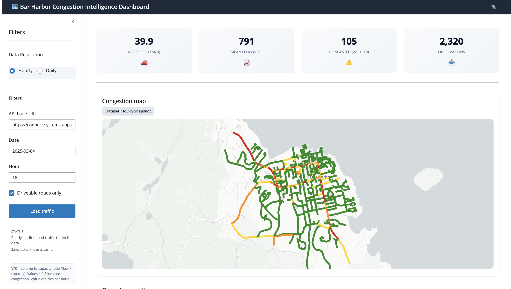
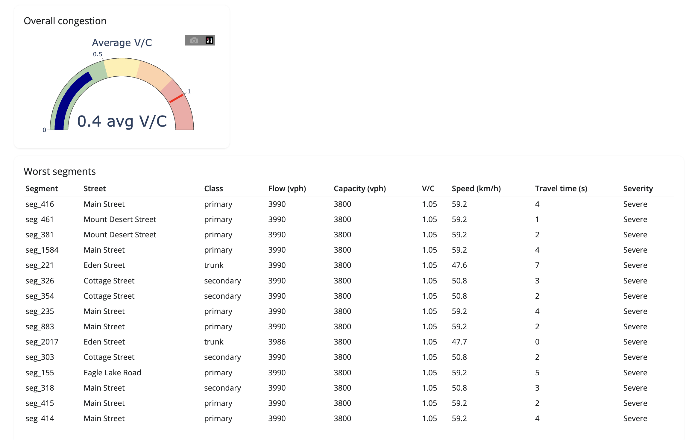
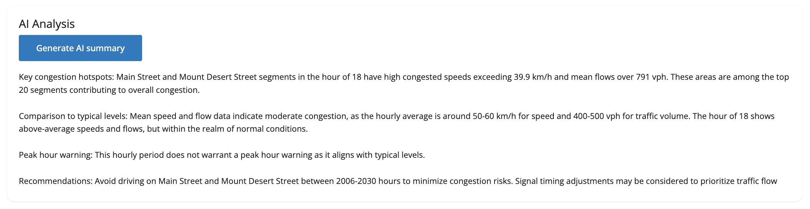
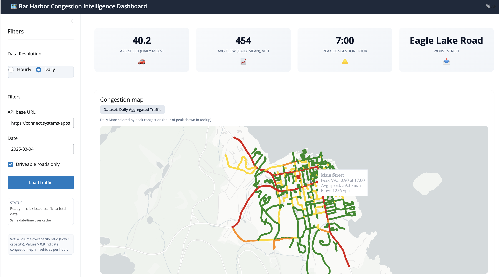
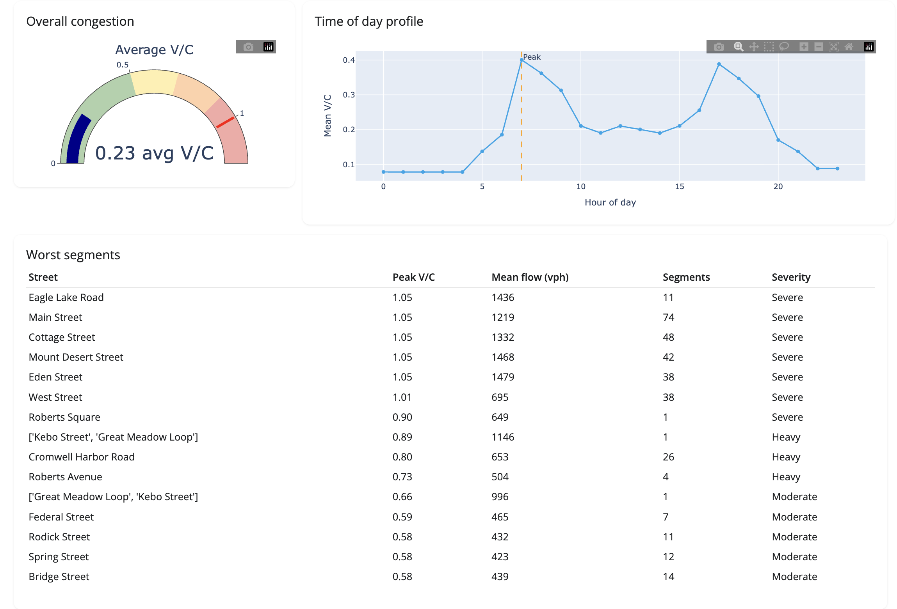
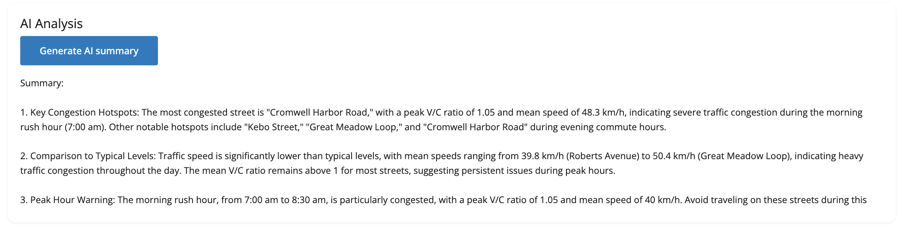
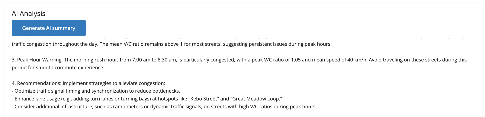

# Bar Harbor Congestion Intelligence Dashboard

## 1. Overview

The **Bar Harbor Congestion Intelligence Dashboard** is a Shiny for Python app for city staff: it shows traffic congestion for the Bar Harbor road network using data from the Bar Harbor Traffic Report API (Supabase-backed). The app offers an interactive map, KPIs and gauge, a ranked worst-congestion table, and optional AI-generated summaries via Ollama. Details are in [§3. Features](#3-features).

---

## 2. Installation

### Requirements

- **Python**: 3.8 or later (3.9+ recommended).
- **Package manager**: `pip`.

### Steps

1. **Clone or open the project** and go to the project root:
   ```bash
   cd /path/to/MidtermSYSEN
   ```

2. **Create and activate a virtual environment** (recommended):
   ```bash
   python3 -m venv venv
   source venv/bin/activate   # On Windows: venv\Scripts\activate
   ```

3. **Install dependencies**:
   ```bash
   pip install -r requirements.txt
   ```
   Key packages for the Shiny dashboard: `shiny`, `pydeck`, `httpx`, `pandas`, `plotly`, `python-dotenv`.

4. **Environment variables** (optional; defaults work for the published API and local Ollama):
   - Create a `.env` file in the **project root** (same folder as `requirements.txt`).
   - **Traffic API**  
     - `TRAFFIC_API_BASE_URL` — Base URL of the Bar Harbor Traffic Report API.  
     - Default: `https://connect.systems-apps.com/content/4579a545-541d-412e-93d4-b35ef9cbca66`
   - **Ollama (AI summary)**  
     - `OLLAMA_BASE_URL` — Default: `http://localhost:11434`  
     - `OLLAMA_API_KEY` — Optional; leave unset for local Ollama.  
     - `OLLAMA_MODEL` — Default: `smollm2:1.7b`
   - Example `.env`:
     ```env
     TRAFFIC_API_BASE_URL=https://connect.systems-apps.com/content/4579a545-541d-412e-93d4-b35ef9cbca66
     OLLAMA_MODEL=smollm2:1.7b
     ```

5. **Run the app**:
   ```bash
   shiny run app/app.py --port 8765
   ```
   Or use the provided script (sets API URL and optional venv):
   ```bash
   ./run_dashboard_with_api.sh
   ```
   Then open a browser to `http://127.0.0.1:8765`.

---

## 3. Features

### 3.1 Two data sets: Hourly vs daily

- **Data Resolution** control in the sidebar: **[ Hourly ]** and **[ Daily ]**.
- **Hourly**: Choose a **date** and **hour** (0–23). The app requests that single hour from the API; the map, KPIs, and Worst Table reflect that hour only.
- **Daily**: Choose a **date** only. The app requests the full day (0–23); the map is colored by **peak** v/c per segment (with peak hour in the tooltip), and KPIs/Worst Table use daily aggregates.

This satisfies the requirement to support **multiple datasets** (hourly and daily).

### 3.2 KPIs and gauge

- **Four summary cards** (labels and values depend on mode):
  - **Hourly**: Avg speed (km/h), Mean Flow (vph), Congested (v/c > 0.8), Observations.
  - **Daily**: Avg speed (daily mean), Avg flow (daily mean), vph, Peak congestion hour, Worst Street (name of street with highest peak v/c).
- **Overall congestion gauge**: Plotly gauge showing average v/c (volume-to-capacity ratio).

### 3.3 Map and peak congestion

- **Congestion map**: PyDeck map of road segments; color = congestion level (green → yellow → orange → red by v/c).
- **Hourly**: Color = v/c for the selected hour.
- **Daily**: Color = **peak** v/c per segment; tooltip includes "Peak V/C … at H:00" and avg speed/flow.
- **Dataset badge** above the map: "Dataset: Hourly Snapshot" or "Dataset: Daily Aggregated Traffic"; in daily mode, a line explains "Daily Map: colored by peak congestion (hour of peak shown in tooltip)."

### 3.4 Worst Table

- **Hourly**: Top 15 **segments** by v/c. Columns: Segment, Street, Class, Flow (vph), Capacity (vph), V/C, Speed (km/h), Travel time (s), Severity.
- **Daily**: Top 15 **streets** (aggregated) by peak v/c. Columns: Street, Peak V/C, Mean flow (vph), Segments, Severity.
- Sidebar note: **V/C** = volume-to-capacity ratio (flow ÷ capacity); values > 0.8 indicate congestion. **vph** = vehicles per hour.

### 3.5 AI summary (Ollama)

- **"Generate AI summary"** button below the Worst Table sends the current slice (top segments/streets and KPIs) to Ollama.
- Placeholder text: "Generate a summary of observations and recommendations."
- Output: Plain-language summary (hotspots, comparison, peak-hour note, recommendations). If Ollama is unavailable or errors, the app shows "Summary unavailable." with a short error hint.
- Requires Ollama running (e.g. `ollama serve`) and the model available (e.g. `ollama pull smollm2:1.7b`).

---

## 4. Usage and screenshots

### How to use the app

1. Open the app in a browser (e.g. `http://127.0.0.1:8765`).
2. In the sidebar: choose **Data Resolution** (Hourly or Daily), **Date**, and in Hourly mode the **Hour**.
3. Optionally set **API base URL** and **Driveable roads only**.
4. Click **Load traffic** (or rely on auto-load when changing date/hour/mode).
5. Review the **KPI cards**, **congestion map**, **Worst Table**, and (in Daily mode) the **Time of day profile** chart.
6. Click **Generate AI summary** to get an Ollama-generated summary of the current data.

#### 4.1 Hourly

**Map view (hourly)**



**Gauge and Worst Table (hourly)**



**AI summary (hourly)**



#### 4.2 Daily

**Map view (daily)**



**Gauge, KPIs, and Worst Table (daily)**



**AI summary (daily)**





---

## 5. File and project structure

| Path | Description |
|------|-------------|
| `app/app.py` | Shiny app: UI, server, map, KPIs, Worst Table, AI summary |
| `app/api_client.py` | API client: `fetch_segments`, `fetch_observations` |
| `app/map_utils.py` | Map helpers: `wkt_to_lonlat_path`, `vc_to_color`, `build_map_data` |
| `run_dashboard_with_api.sh` | Script to run dashboard with API URL set |
| `requirements.txt` | Python dependencies |
| `.env` | Optional env vars (API URL, Ollama); not committed |
