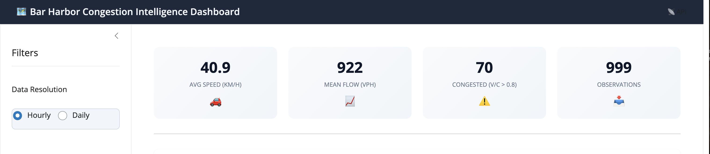
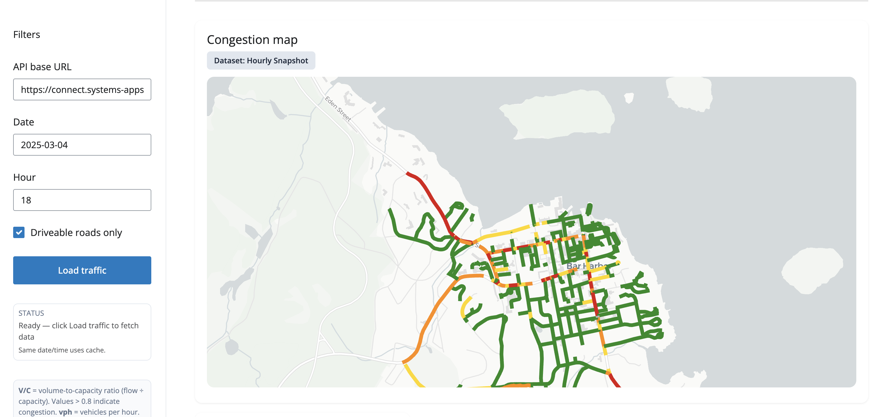
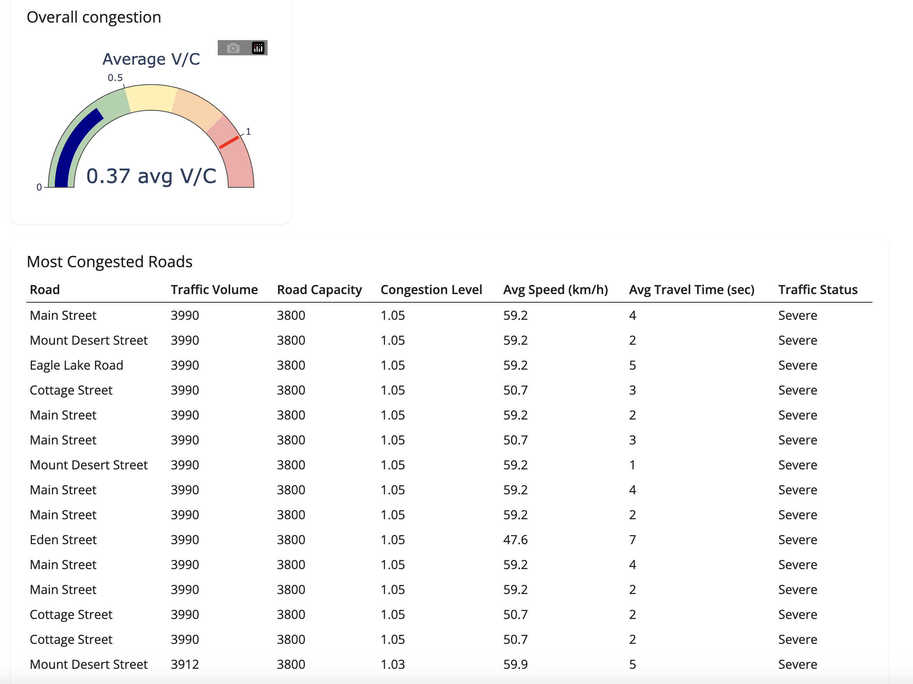
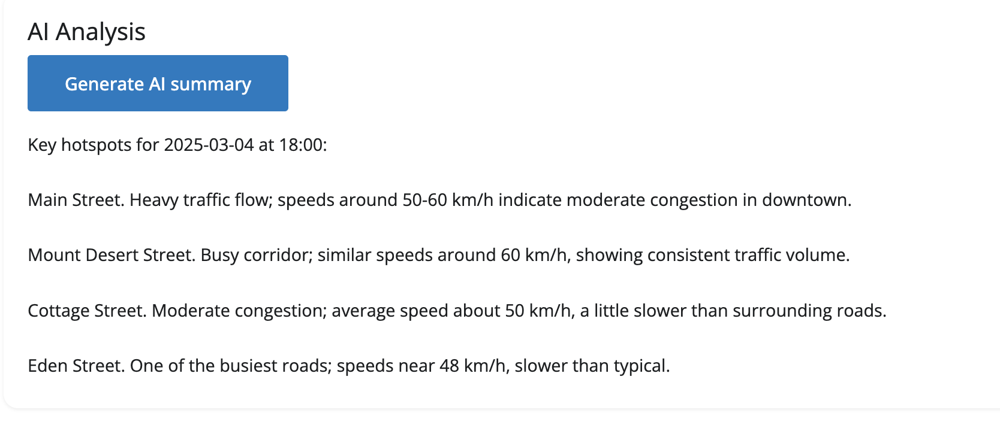
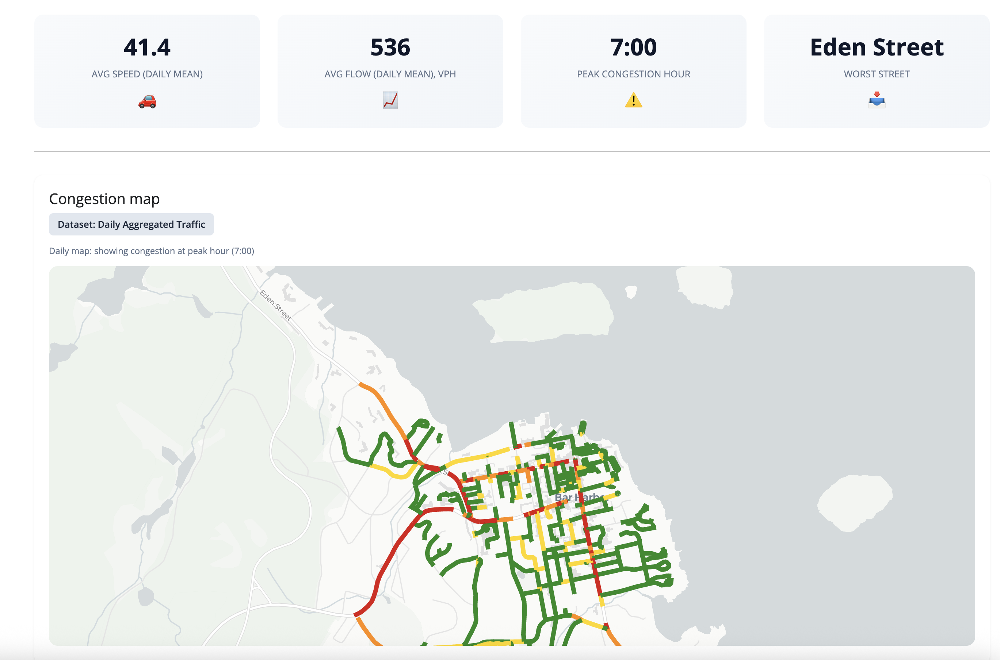
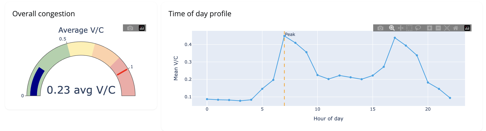
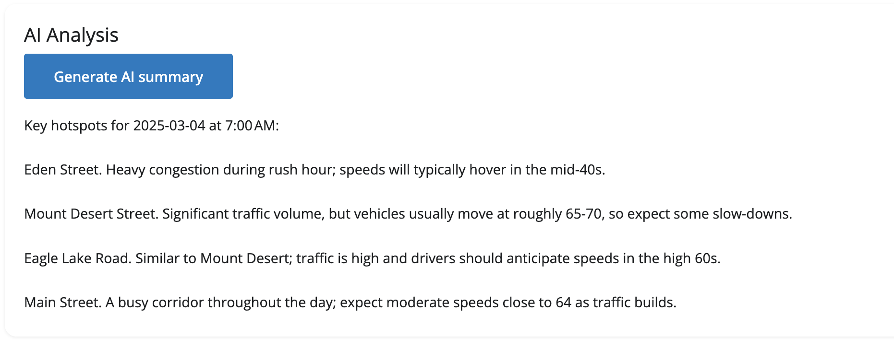

# App Functionality — Bar Harbor Congestion Intelligence Dashboard

This document describes dashboard functionality. The app supports two data views: **Hourly** (one hour per date) and **Daily** (full day with peak-hour analysis).

---

## 1. Overview of capabilities

The Bar Harbor Congestion Intelligence Dashboard lets users:

1. **Choose data resolution** — **Hourly** (single hour for a date) or **Daily** (full day with peak congestion hour).
2. **Filter by date and time** — Date picker; in Hourly mode, an hour selector (0–23).
3. **Load traffic data** — One click fetches segments and traffic windows from the Bar Harbor Traffic Report API.
4. **View an interactive congestion map** — Road segments colored by volume-to-capacity (V/C): green (free flow) → yellow → orange → red (severe).
5. **Monitor KPIs and a gauge** — Four metric cards and an overall congestion gauge.
6. **Inspect the most congested roads** — Ranked table (top 15 segments in Hourly, top 15 streets in Daily).
7. **See a time-of-day profile** — In Daily mode, a chart of congestion by hour with the peak hour marked.
8. **Generate an AI summary** — Plain-language hotspot summary and recommendations via Ollama Cloud (requires `OLLAMA_API_KEY`).

The following sections walk through **Hourly View** and **Daily View** and use screenshots to show each capability.

---

## 2. Hourly View

In **Hourly** mode, the app requests a **single hour** of data for the chosen date. The map, KPIs, gauge, and table all reflect that one hour. This is ideal for answering questions like “What did congestion look like at 6 p.m. on March 4?”

### 2.1 Hourly dashboard overview

In Hourly mode the sidebar shows **Data Resolution: Hourly**, a **Date** picker, and an **Hour** selector (0–23). The user sets **API base URL**, optionally checks **Driveable roads only**, and clicks **Load traffic** to fetch segments and the traffic window for that date and hour. The screenshot below shows the full Hourly view: sidebar, KPI cards, and congestion map.

### 2.2 KPI cards (Hourly)

The four metric cards in Hourly mode show:

| Card | Meaning |
|------|--------|
| **Avg speed (km/h)** | Average speed across segments for the selected hour. |
| **Mean Flow (vph)** | Average flow (vehicles per hour) across segments. |
| **Congested (v/c > 0.8)** | Number of segments with volume-to-capacity ratio above 0.8. |
| **Observations** | Count of observation rows used (e.g. segment count for that window). |

*(KPIs are visible in the Hourly dashboard overview above.)*

### 2.3 Congestion map (Hourly)

- **Dataset badge:** “Dataset: Hourly Snapshot.”
- **Map:** Each road segment is colored by its **V/C ratio for that hour** (green → yellow → orange → red).
- **Tooltip:** Hovering a segment shows street name, speed (km/h), flow (vph), and V/C for that hour.

### 2.4 Gauge and “Most Congested Roads” table (Hourly)

- **Overall congestion gauge:** Plotly gauge showing the average V/C across the network for that hour (0–1+).
- **Most Congested Roads:** Top 15 **segments** by V/C, with columns such as Segment, Street, Flow (vph), Capacity (vph), V/C, Speed (km/h), Travel time (s), Severity.

### 2.5 AI summary (Hourly)

- **Generate AI summary** sends the current hour’s KPIs and top segments to Ollama Cloud.
- The model returns a short, conversational summary (hotspots, snapshot context, recommendations) in plain text; the app sanitizes markdown before display.

---

## 3. Daily View

In **Daily** mode, the app requests **all 24 hours** for the chosen date (23 one-hour windows), then:

- Computes the **network-wide peak congestion hour** (the hour with the highest average V/C).
- **Map:** Shows congestion **at that peak hour only**, so the map matches the “Peak congestion hour” KPI.
- **KPIs and table:** Use daily aggregates (e.g. daily mean speed/flow, peak hour, worst street by peak V/C).
- **Time-of-day profile:** A chart of congestion by hour with the peak hour marked.

### 3.1 Daily dashboard overview

In **Daily** mode the sidebar shows **Data Resolution: Daily** and a **Date** picker (no hour selector). Clicking **Load traffic** triggers 23 API calls (one per hour), then combines results and computes the peak congestion hour and daily stats. The screenshot below shows the full Daily view: sidebar, KPI cards (including **Peak congestion hour** and **Worst Street**), congestion map at the peak hour, gauge, time-of-day profile, and Most Congested Roads table.

### 3.2 KPI cards (Daily)

The four cards in Daily mode show:

| Card | Meaning |
|------|--------|
| **Avg speed (daily mean)** | Average speed across segments over the full day. |
| **Avg flow (daily mean), vph** | Average flow over the day. |
| **Peak congestion hour** | The hour (e.g. 18:00) when network-wide congestion is highest. |
| **Worst Street** | Street name with the highest peak V/C. |

*(KPIs are visible in the Daily panel overview above.)*

### 3.3 Congestion map (Daily)

- **Dataset badge:** “Dataset: Daily Aggregated Traffic” and the caption **“Daily map: showing congestion at peak hour (HH:00)”** (e.g. 18:00).
- **Map:** Segment colors show **V/C at the peak hour only** (the same hour as the “Peak congestion hour” KPI).
- **Tooltip:** Peak V/C at that hour, speed, and flow for the segment.

*(The map at peak hour is visible in the Daily panel overview above.)*

### 3.4 Gauge, time-of-day profile, and table (Daily)

- **Overall congestion gauge:** Average V/C (daily aggregate).
- **Time of day profile:** Bar or line chart of congestion by hour (0–23) with the **peak hour** marked (e.g. dashed line or annotation).
- **Most Congested Roads:** Top 15 **streets** (aggregated) by peak V/C, with columns such as Street, Peak V/C, Mean flow (vph), Segments, Severity.

### 3.5 AI summary (Daily)

- Same **Generate AI summary** flow as Hourly; the prompt includes daily KPIs, peak hour, and top streets so the summary can reference “peak hour” and street-level hotspots.

---

## 4. Summary: Hourly vs Daily

| Feature | Hourly View | Daily View |
|--------|-------------|------------|
| **Input** | Date + hour (0–23) | Date only |
| **API calls** | 1 × GET /traffic/window | 23 × GET /traffic/window (then combined) |
| **Map shows** | V/C for the selected hour | V/C at the **peak congestion hour** only |
| **Third KPI** | Congested (v/c > 0.8) | Peak congestion hour (e.g. 18:00) |
| **Fourth KPI** | Observations count | Worst Street name |
| **Table** | Top 15 segments | Top 15 streets (by peak V/C) |
| **Extra chart** | — | Time-of-day profile (peak marked) |

---

## 5. Test execution and demonstration

For **accurate, working test executions** and a **clear demonstration** of the tool:

1. **Hourly test:** Select **Hourly**, choose a date (e.g. 2025-03-04) and hour (e.g. 18). Click **Load traffic**. Confirm KPIs, map colors, and table update for that hour. Optionally run **Generate AI summary** and confirm a plain-language summary appears.
2. **Daily test:** Select **Daily**, choose the same or another date. Click **Load traffic**. Confirm “Peak congestion hour” appears in the third KPI, the map caption shows “showing congestion at peak hour (HH:00),” the time-of-day chart appears with peak marked, and the table lists streets. Optionally run **Generate AI summary**.
3. **Screenshots:** The **`ScreenShots`** folder contains the images used in this document: **HourlyDashboard**, **HourlyViewCongestionMap**, **HourlyViewCongestionVC**, **HourlyViewAIHelper** (Hourly); **DailyViewPanel**, **DailyViewTrafficPatterns**, **DailyViewAI** (Daily). Together they demonstrate the app in action for your submission.
