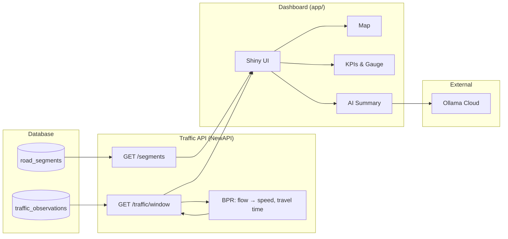
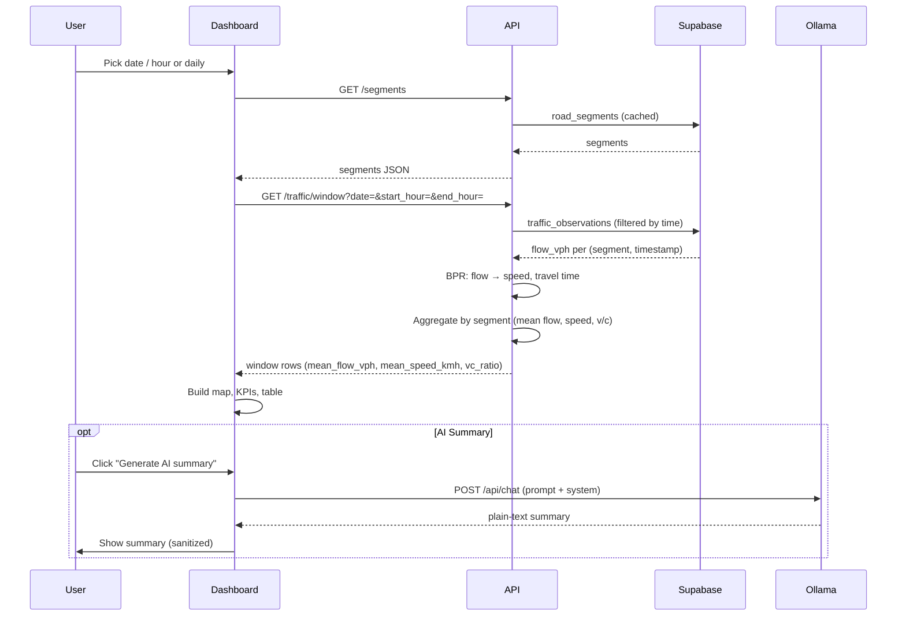
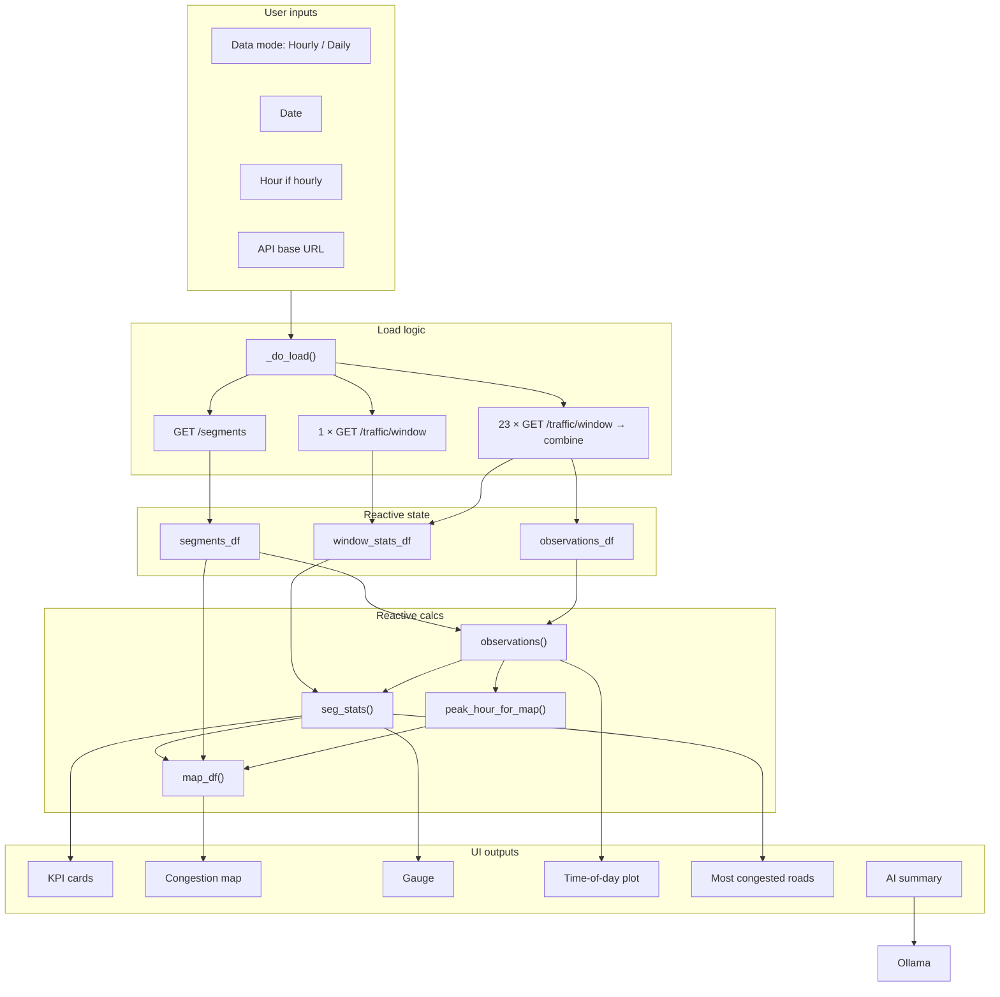
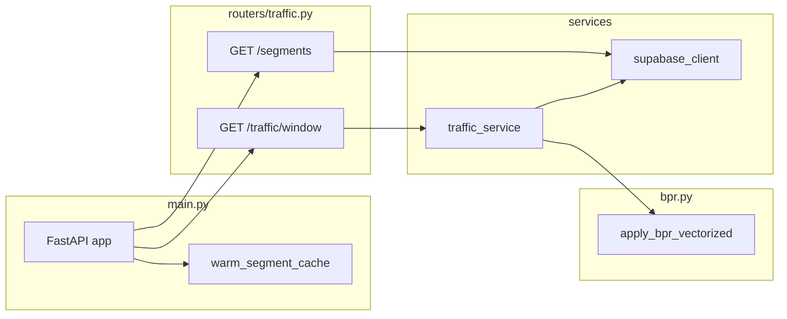

# Bar Harbor Congestion Intelligence Pipeline

A full-stack traffic congestion pipeline for the Bar Harbor road network: **Supabase** holds segments and flow observations, the **Traffic API** (FastAPI) applies the BPR model and serves aggregated windows, and the **Shiny dashboard** shows an interactive map, KPIs, and AI-generated summaries via Ollama Cloud.

---

## Table of contents

- [High-level architecture](#high-level-architecture)
- [Data flow](#data-flow)
- [How the dashboard works](#how-the-dashboard-works)
- [How the API works](#how-the-api-works)
- [Run everything locally](#run-everything-locally)
- [Project layout](#project-layout)
- [More documentation](#more-documentation)

---

## High-level architecture



**In words:** Supabase stores road segments and per-segment, per-timestamp flow. The API reads segments (cached) and observations for a time window, runs the BPR formula to get speed and travel time, and returns one row per segment. The dashboard calls the API, draws the map and KPIs, and optionally sends a summary prompt to Ollama Cloud.

---

## Data flow



**Daily mode:** The dashboard issues **23** `GET /traffic/window` calls (one per hour), concatenates the results, computes the network-wide peak congestion hour, and uses **only that hour’s data** for the map so the map matches the “Peak congestion hour” KPI.

---

## How the dashboard works



**Key ideas:**

- **Hourly:** One time window → one window stats DataFrame → map and KPIs for that hour.
- **Daily:** 23 windows → combined observations + daily aggregate; `peak_hour_for_map()` picks the worst hour; the map uses only that hour’s stats so the map and “Peak congestion hour” match.
- **AI summary:** Current KPIs and top segments/streets are turned into a plain-language prompt; the app calls `query_llm()` (Ollama Cloud), then sanitizes the reply (no markdown) and shows it in the UI.

---

## How the API works



**Request path for `/traffic/window`:**

1. **traffic_service.get_traffic_window(date, start_hour, end_hour)**  
   - Converts the window to ISO start/end.  
   - Fetches segments (from cache) and observations in that window from Supabase.  
   - Merges observations to segment index, runs **BPR** (vectorized) to get speed and travel time.  
   - Aggregates by segment (mean flow, mean speed, mean travel time), computes v/c.  
   - Returns a list of dicts → Pydantic `TrafficWindowRow`.

2. **supabase_client**  
   - `fetch_segments()`: reads `road_segments` once and caches.  
   - `fetch_observations_window(start_iso, end_iso)`: filters `traffic_observations` by `timestamp >= start` and `timestamp < end`.

---

## Run everything locally

Follow these steps to run the **Traffic API** and the **Shiny dashboard** on your machine.

### Prerequisites

- **Python 3.9+**
- **pip**
- (Optional) **Supabase** project with `road_segments` and `traffic_observations` populated — only needed if you run the API yourself; the dashboard can use a deployed API URL.

---

### Step 1: Clone and go to the project root

```bash
cd /path/to/MidtermSYSEN
```

---

### Step 2: Create and activate a virtual environment

```bash
python3 -m venv venv
source venv/bin/activate   # Windows: venv\Scripts\activate
```

---

### Step 3: Install dependencies

```bash
pip install -r requirements.txt
```

This installs everything for the dashboard (Shiny, PyDeck, httpx, pandas, plotly, python-dotenv, shapely, etc.). If you plan to run the **API** from the `NewAPI` folder, install its dependencies too:

```bash
pip install -r NewAPI/api/requirements.txt
```

(You can do this from the repo root if the path exists.)

---

### Step 4: Configure environment variables

**Dashboard (required for AI summary; optional for API URL):**

Create a `.env` file in the **project root** (same folder as `requirements.txt`):

```env
# Optional: default is a deployed API URL
TRAFFIC_API_BASE_URL=http://127.0.0.1:8000

# Required for "Generate AI summary"
OLLAMA_API_KEY=your_ollama_cloud_api_key_here
OLLAMA_MODEL=gpt-oss:20b-cloud
```

- If you **omit** `TRAFFIC_API_BASE_URL`, the app uses the default (e.g. a Posit Connect URL).  
- To use your **local API**, set `TRAFFIC_API_BASE_URL=http://127.0.0.1:8000`.  
- If `OLLAMA_API_KEY` is missing, the app still runs but “Generate AI summary” will show an error asking you to set it.

**API (only if you run the API locally):**

Create a `.env` in **NewAPI/** or in the **project root** with your Supabase credentials:

```env
SUPABASE_URL=https://YOUR_PROJECT.supabase.co
SUPABASE_ANON_KEY=your_anon_key_here
```

The API loads `.env` from `NewAPI/`, then repo root, then `supabase and api/`.

---

### Step 5: Run the Traffic API (optional)

Only needed if you want to use your own Supabase data. If you skip this, use the default dashboard API URL (no .env change).

From the **project root**:

```bash
./NewAPI/run_api_local.sh
```

Or from **NewAPI/**:

```bash
cd NewAPI
uvicorn api.main:app --host 0.0.0.0 --port 8000
```

You should see something like: `Uvicorn running on http://0.0.0.0:8000`.

- Health: [http://127.0.0.1:8000/health](http://127.0.0.1:8000/health)  
- Docs: [http://127.0.0.1:8000/docs](http://127.0.0.1:8000/docs)

If you use the local API, set in **project root** `.env`:

```env
TRAFFIC_API_BASE_URL=http://127.0.0.1:8000
```

---

### Step 6: Run the Shiny dashboard

From the **project root** (with venv activated):

```bash
./run_app.sh
```

Or directly:

```bash
shiny run app/app.py --port 8767
```

Then open a browser to:

**http://127.0.0.1:8767**

---

### Step 7: Use the dashboard

1. Leave **API base URL** as is (or set to `http://127.0.0.1:8000` if you ran the API locally).  
2. Choose **Data Resolution:** **Hourly** (date + hour) or **Daily** (date only).  
3. Click **Load traffic.**  
4. Inspect the map, KPI cards, gauge, “Most Congested Roads” table, and (in daily mode) the time-of-day profile.  
5. Optionally click **Generate AI summary** (requires `OLLAMA_API_KEY` in `.env`).

---

### Quick reference: ports and URLs

| What | URL |
|------|-----|
| Dashboard | http://127.0.0.1:8767 |
| API (local) | http://127.0.0.1:8000 |
| API health | http://127.0.0.1:8000/health |
| API docs | http://127.0.0.1:8000/docs |

---

### Troubleshooting

| Issue | What to do |
|-------|------------|
| “Please enter API base URL” | Enter the API URL in the sidebar (e.g. `http://127.0.0.1:8000` or the default). |
| 503 on /segments or /traffic/window | Set `SUPABASE_URL` and `SUPABASE_ANON_KEY` where the API loads .env and restart the API. |
| Empty map or no data | Check that the chosen date has data in Supabase; try another date or the deployed API. |
| AI summary error: “OLLAMA_API_KEY is not set” | Add `OLLAMA_API_KEY` to project root `.env` and restart the dashboard. |
| Port 8767 in use | Run `shiny run app/app.py --port 8768` (or another free port). |
| Port 8000 in use | Run the API with `--port 8001` and set `TRAFFIC_API_BASE_URL=http://127.0.0.1:8001`. |

---

## Project layout

```text
MidtermSYSEN/
├── app/                    # Shiny dashboard
│   ├── app.py              # Main UI and server logic
│   ├── api_client.py       # Cached HTTP client for Traffic API
│   ├── llm_cloud.py        # Ollama Cloud chat (AI summary)
│   ├── map_utils.py        # WKT, v/c→color, build_map_data
│   └── requirements.txt   # Dashboard-only deps
├── NewAPI/
│   ├── api/
│   │   ├── main.py         # FastAPI app, lifespan
│   │   ├── schemas.py      # Pydantic models
│   │   ├── bpr.py          # BPR formula (vectorized)
│   │   ├── routers/
│   │   │   └── traffic.py  # GET /segments, /traffic/window
│   │   └── services/
│   │       ├── supabase_client.py  # Segments + observations
│   │       └── traffic_service.py  # Window aggregation + BPR
│   ├── run_api_local.sh    # Start API (from repo root or NewAPI)
│   └── TEST_API_LOCALLY.md
├── ScreenShots/            # Screenshots for App Functionality doc
├── run_app.sh              # Start Shiny app (port 8767)
├── requirements.txt        # Dashboard and pipeline deps
├── .env.example            # Example .env for dashboard + Ollama
├── CODEBOOK.md             # File and variable reference (app + NewAPI)
├── App Functionality.md    # What the app does + screenshot walkthrough
├── App Link.md             # Deployed dashboard URL
└── README.md               # This file
```

---

## More documentation

- **[CODEBOOK.md](CODEBOOK.md)** — File-by-file and variable-level reference for `app/` and `NewAPI/api/`: functions, reactive state, env vars, and data dictionary.
- **[App Functionality.md](App%20Functionality.md)** — Dashboard capabilities with screenshots: Hourly vs Daily view, map, KPIs, gauge, table, time-of-day profile, AI summary.
- **[App Link.md](App%20Link.md)** — Link to the deployed Bar Harbor Congestion Intelligence Dashboard.
- **[.env.example](.env.example)** — Example environment variables for the dashboard and Ollama Cloud.
- **[NewAPI/TEST_API_LOCALLY.md](NewAPI/TEST_API_LOCALLY.md)** — Focused steps to run and test the API locally.
