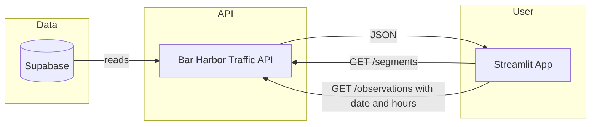

# Bar Harbor Traffic — Simple Guide

One-page overview: what the system does, how data flows, how to call the API, and how to run the app.

---

## What It Does (ELI5)

1. **Roads** are stored in Supabase (each segment has an ID, length, capacity).
2. **Traffic counts** (cars per hour per segment, by time) are also in Supabase.
3. The **API** reads that data and uses a formula (BPR) to compute **speed** and **travel time** for each observation.
4. The **app** calls the API, shows a map of Bar Harbor, and lets you pick a **time window** (e.g. 6–7pm Tuesday). It then loads only that window’s traffic and colors the map (green = low congestion, red = high).

So: **Database → API (adds speed/travel time) → App (map + time picker).**

---

## Flow (High Level)



**Step by step:**

1. **App opens** → Calls **GET /segments** → Gets all road segments → Shows a **gray baseline map** of Bar Harbor.
2. **User picks** date + start hour + end hour (e.g. Tuesday 6–7pm) and clicks **“Show traffic for this time”**.
3. **App** calls **GET /observations?date=...&start_hour=18&end_hour=19&limit=10000** → Gets only that window’s data.
4. **App** colors each segment by congestion (v/c) → **Traffic map** (green → red).
5. Errors and request logs appear in the **“Error details / logs”** section at the bottom.

---

## The API (How to Call It)

**Base URL (published):**  
`https://connect.systems-apps.com/content/4579a545-541d-412e-93d4-b35ef9cbca66`

**Local:**  
`http://127.0.0.1:8000` (when you run `uvicorn api_main:app --reload` from `supabase and api/`).

### Endpoints

| What | URL | Notes |
|------|-----|--------|
| **Road segments** | `GET {base}/segments` | All segments (geometry, length, road_class, capacity, etc.). |
| **Traffic for a time window** | `GET {base}/observations?date=YYYY-MM-DD&start_hour=18&end_hour=19&limit=10000` | Only that hour (e.g. 6–7pm). Returns flow, speed_kmh, travel_time_sec. |
| **Traffic for a full day** | `GET {base}/observations?date=2025-03-03&limit=10000` | All observations for that day. |

### Example: curl

```bash
# Segments (road network)
curl -s "https://connect.systems-apps.com/content/4579a545-541d-412e-93d4-b35ef9cbca66/segments" | head -c 500

# Observations for Tuesday 6–7pm (small payload)
curl -s "https://connect.systems-apps.com/content/4579a545-541d-412e-93d4-b35ef9cbca66/observations?date=2025-03-04&start_hour=18&end_hour=19&limit=100"
```

### Query parameters for `/observations`

| Param | Meaning |
|-------|--------|
| `date` | Day in `YYYY-MM-DD`. |
| `start_hour` | Start of window (0–23). Use with `end_hour` for one hour (e.g. 18 = 6pm). |
| `end_hour` | End of window (0–23). e.g. 19 = 7pm → window 6–7pm. |
| `limit` | Max rows returned (e.g. 10000). Use to avoid timeouts. |

---

## How to Run the App

**Easiest (from project root):**

```bash
./run_app.sh
```

That script: creates/uses a venv, installs dependencies, and runs the Streamlit app.

**Or by hand:**

```bash
cd /Users/mjt/Desktop/MidtermSYSEN
source venv/bin/activate
pip install -r requirements.txt
streamlit run app/streamlit_app.py
```

Then open the URL in your browser (e.g. http://localhost:8501). Enter the API base URL in the sidebar (or leave the default), pick a date and time range, and click **“Show traffic for this time”**.

---

## How to Run the API Locally

Used when you want the app to talk to your own API (e.g. with a local `.env` for Supabase).

```bash
cd "supabase and api"
cp .env.example .env
# Edit .env: set SUPABASE_URL and SUPABASE_ANON_KEY
source ../venv/bin/activate
pip install -r requirements.txt
uvicorn api_main:app --reload
```

Then use `http://127.0.0.1:8000` as the API base URL in the app. Docs: http://127.0.0.1:8000/docs.

---

## Main Pieces (Where Things Live)

| Piece | Where | Role |
|-------|--------|------|
| **Database** | Supabase | Stores `road_segments` and `traffic_observations` (raw flow only). |
| **API** | `supabase and api/` | FastAPI: GET /segments, GET /observations (with date/hour filter, BPR applied). |
| **App** | `app/streamlit_app.py` | Streamlit: baseline map → user picks time → load traffic → congestion map + logs. |
| **Run script** | `run_app.sh` | Venv + install + start Streamlit app. |

---

## App UX (Short)

- **On load:** Map shows Bar Harbor roads in gray (no traffic yet).
- **Sidebar:** API URL, **Date**, **Start hour**, **End hour**, “Show traffic for this time” button.
- **After “Show traffic”:** Map colors segments by congestion; legend and metrics under the map.
- **Errors:** Shown in the “Error details / logs” expander at the bottom.

All of this uses the **deployed FastAPI** (or your local one); the app does not talk to Supabase directly.
